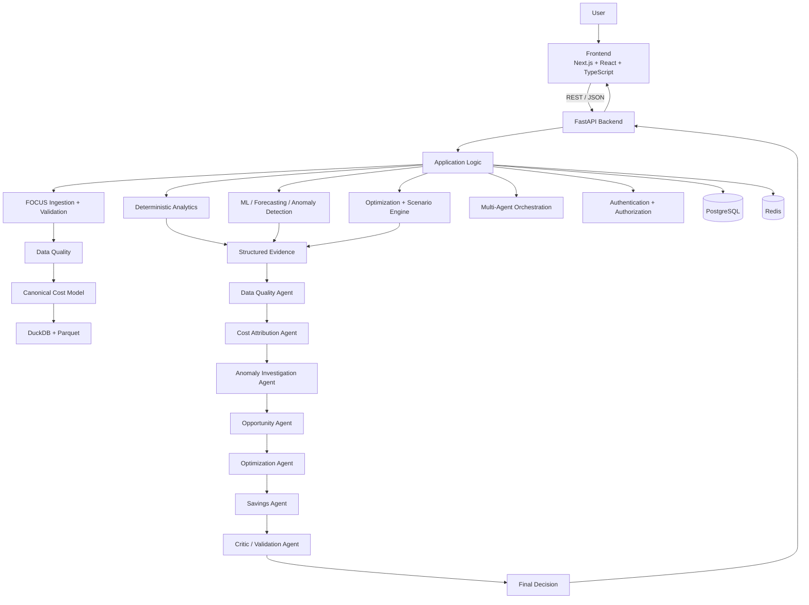
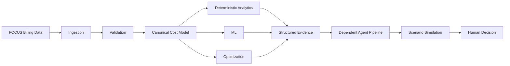
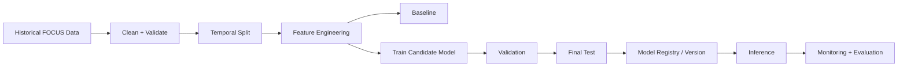
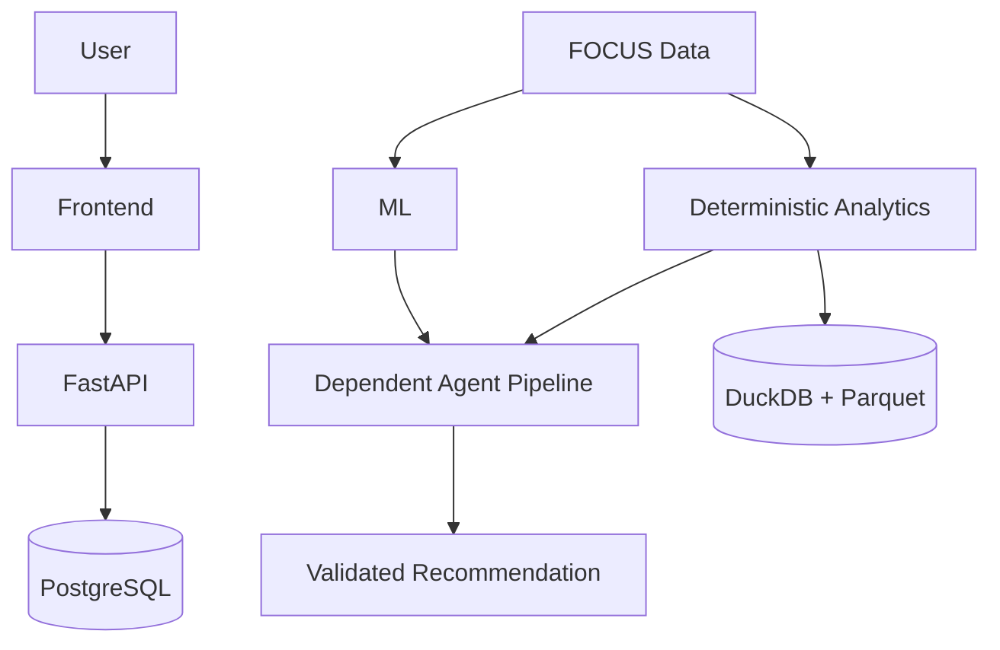

# CloudSpend Intelligence — Antigravity Master Prompt

## 1. Objective

Build **CloudSpend Intelligence**, a production-quality FinOps / cloud-cost decision-intelligence platform using publicly available **FOCUS (FinOps Open Cost and Usage Specification)** billing data.

It must be portfolio-grade, reproducible, interview-ready, and technically defensible.

Do **not** build a generic chatbot, an LLM-wrapped dashboard, disconnected agents, or an unnecessarily complex microservice system.

---

## 2. Core Product

CloudSpend answers:

1. Where is technology spend going?
2. Why did spend change?
3. Which accounts/services/resources caused it?
4. Which changes are anomalous?
5. Which opportunities deserve investigation?
6. What optimization actions are plausible?
7. What could those actions save?
8. How confident is the system?
9. What evidence supports the recommendation?
10. Which recommendation should be prioritized?

Core loop:

**OBSERVE → EXPLAIN → DETECT → DIAGNOSE → OPTIMIZE → ESTIMATE → VALIDATE → DECIDE**

This is a **decision-support system**. It must not automatically modify or delete production cloud resources.

---

# 3. Absolute Engineering Rules

### Simplicity over ceremony

Use the simplest architecture that correctly solves the problem.

Do not create abstractions without a real repeated use case.

Avoid unnecessary:
- BaseService
- BaseRepository
- AbstractFactory
- GenericManager
- GenericController
- GenericAgent
- utility/wrapper layers

### Minimum file count

Every file must have a clear purpose.

Before creating a file, ask:

> Does this need to exist independently?

If not, keep it in an existing cohesive module.

Do not split small pieces into dozens of tiny files.

### Clean repository

The repository must look deliberately engineered, not AI-generated.

Remove:
- unused files
- duplicate implementations
- dead code
- empty directories
- placeholder components
- unnecessary dependencies
- `test123.py`
- `agent_final_v2.py`
- `utils2.py`
- `temp.py`
- `debug.py`
- `old/`
- `backup/`

### Frontend/backend separation

Use a clean monorepo with explicit frontend/backend boundaries.

### No fake enterprise complexity

Do not introduce Kubernetes, Terraform, service meshes, distributed microservices, or dozens of containers unless a real requirement emerges.

The MVP should run with:

```bash
docker compose up
```

---

# 4. System Architecture

Use a **modular monolith** for the MVP.

## High-level architecture



## Data flow



### Critical principle

**Deterministic analytics are the foundation. Agents sit on top of them. The LLM is not the numerical source of truth.**

---

# 5. Repository Structure

Use this as the default:

```text
cloudspend/
├── frontend/
│   ├── app/
│   ├── components/
│   ├── lib/
│   ├── public/
│   ├── package.json
│   ├── tsconfig.json
│   └── next.config.ts
│
├── backend/
│   ├── app/
│   │   ├── main.py
│   │   ├── config.py
│   │   ├── db.py
│   │   ├── models.py
│   │   ├── schemas.py
│   │   ├── api.py
│   │   ├── analytics.py
│   │   ├── anomaly.py
│   │   ├── forecasting.py
│   │   ├── optimization.py
│   │   ├── scenarios.py
│   │   ├── agents.py
│   │   ├── ingestion.py
│   │   └── auth.py
│   ├── tests/
│   ├── requirements.txt
│   └── Dockerfile
│
├── data/
│   ├── demo/
│   └── README.md
│
├── docs/
│   ├── ARCHITECTURE.md
│   ├── PRODUCT.md
│   ├── DATA.md
│   ├── ML.md
│   ├── AGENTS.md
│   ├── EVALUATION.md
│   └── LIMITATIONS.md
│
├── tests/
│   └── e2e/
│
├── docker-compose.yml
├── .env.example
├── .gitignore
└── README.md
```

This is a starting point, not a reason to create unnecessary modules.

If a module becomes genuinely too large, split it. If two small modules are tightly coupled, combine them.

Prefer a cohesive `analytics.py` over artificial layers such as:

```text
analytics_service.py
analytics_repository.py
analytics_manager.py
analytics_utils.py
analytics_helpers.py
```

unless those separations are genuinely necessary.

---

# 6. Frontend

Use:

- Next.js
- React
- TypeScript
- Tailwind CSS
- Recharts or equivalent

Suggested routes:

```text
/dashboard
/spend
/anomalies
/investigations
/recommendations
/forecasts
/agents
/data-quality
/settings
```

Create reusable components only when they are actually reused.

Do not create artificial abstractions such as `GenericCard`, `BaseChart`, or `UniversalModal` without a real need.

The UI should look like a serious B2B SaaS application.

---

# 7. Backend

Use:

- Python
- FastAPI
- Pydantic
- SQLAlchemy
- DuckDB
- PostgreSQL
- Redis

Keep it a modular monolith.

Core modules:

- `main.py` — entry point
- `api.py` — routes
- `models.py` — DB models
- `schemas.py` — contracts
- `db.py` — DB setup
- `config.py` — configuration
- `ingestion.py` — FOCUS ingestion/validation
- `analytics.py` — deterministic cost analytics
- `anomaly.py` — anomaly detection
- `forecasting.py` — forecasting
- `optimization.py` — optimization opportunities
- `scenarios.py` — what-if simulations
- `agents.py` — agent orchestration
- `auth.py` — authentication/authorization

Split modules only when size or responsibility genuinely requires it.

---

# 8. Real Data

Use publicly available **FOCUS billing data**.

FOCUS = FinOps Open Cost and Usage Specification.

Prefer official FOCUS ecosystem datasets.

The application must be schema/version aware and must not be hardcoded to one historical FOCUS version.

Support:

- CSV
- Parquet

Store:

- source
- dataset version
- schema version
- row count
- date range
- currency
- ingestion timestamp
- validation status
- content hash

Never silently mutate raw data.

---

# 9. Data Pipeline

```text
RAW DATA
   ↓
Schema Inspection
   ↓
Version Detection
   ↓
Validation
   ↓
Normalization
   ↓
Canonical Cost Model
   ↓
Parquet / DuckDB
```

Use PostgreSQL for:

- application state
- metadata
- users
- agent runs
- audit records
- recommendations

Use DuckDB/Parquet for:

- large billing data
- analytical queries
- aggregations

---

# 10. Data Quality

Validate:

- required fields
- data types
- null rates
- duplicates
- invalid costs
- invalid dates
- currency consistency
- malformed identifiers
- missing dimensions

Produce a structured `DataQualityReport`.

Agents must not silently proceed when data quality is insufficient.

---

# 11. Canonical Cost Model

Normalize provider-specific billing records.

Dimensions:

- provider
- account
- subaccount
- service
- category
- resource
- region
- SKU
- charge category
- pricing category

Measures:

- billed cost
- effective cost
- list cost
- contracted cost
- quantity

Time:

- charge period
- billing period

---

# 12. Deterministic Analytics

Implement:

- total spend
- daily/weekly/monthly spend
- provider spend
- account spend
- service spend
- region spend
- resource spend
- top cost drivers
- period-over-period changes
- cost concentration
- effective vs list cost where available
- budget variance

All numerical results must originate from deterministic code/SQL.

---

# 13. Anomaly Detection

Implement real statistical detection.

Start with:

- rolling mean/std
- EWMA
- robust z-score
- seasonal baseline where sufficient history exists

Optional:

- Isolation Forest

Every anomaly must contain:

- entity
- timestamp
- actual
- expected
- deviation
- severity
- detection method
- confidence
- supporting evidence

Do not ask an LLM to calculate anomalies.

---

# 14. Root Cause Analysis

Analyze:

- provider
- account
- subaccount
- service
- region
- resource
- SKU
- charge category
- quantity
- pricing

Produce ranked contributors.

The LLM may explain deterministic findings but must not invent numerical attribution.

---

# 15. Optimization Engine

Build deterministic optimization rules for supported situations:

- unusual cost growth
- resource cost spikes
- cost concentration
- commitment/discount opportunities
- regional pricing differences
- unexpected quantity growth
- idle-resource candidates where evidence actually exists

### Critical honesty rule

Do not infer utilization if utilization data is absent.

Do not say:

> "This VM is underutilized."

if only billing data is available.

Say:

> "This resource is a candidate for investigation because billed cost increased X% while billed quantity changed Y%."

---

# 16. Savings Simulator

Every estimate must include:

- current cost
- scenario
- assumptions
- projected cost
- estimated savings
- confidence

Clearly distinguish:

**ESTIMATED SAVINGS**

from:

**REALIZED SAVINGS**

Never fabricate realized savings.

---

# 17. Forecasting

Implement:

- naive baseline
- moving average
- seasonal baseline where appropriate
- stronger forecasting model

Evaluate using:

- MAE
- RMSE
- WAPE
- forecast bias

Use temporal train/test splits.

Never use future information.

---

# 18. Multi-Agent System

The agents must form a **dependent pipeline**:

```text
Data Quality
     ↓
Cost Attribution
     ↓
Anomaly Investigation
     ↓
Opportunity Identification
     ↓
Optimization
     ↓
Savings Estimation
     ↓
Critic / Validation
     ↓
Final Decision
```

Do not build independent agents that simply produce separate prose.

---

# 19. Agent Contracts

Use structured Pydantic schemas.

Core objects:

- `DataQualityReport`
- `CostAttributionReport`
- `AnomalyReport`
- `OpportunityReport`
- `OptimizationRecommendation`
- `SavingsEstimate`
- `ValidationReport`
- `FinalDecision`

Do not pass arbitrary agent prose as the primary downstream interface.

---

# 20. Agent Responsibilities

### Agent 1 — Data Quality

Determines whether the dataset is usable.

### Agent 2 — Cost Attribution

Determines major cost drivers.

### Agent 3 — Anomaly Investigation

Investigates abnormal changes.

### Agent 4 — Opportunity

Finds optimization candidates.

### Agent 5 — Optimization

Ranks possible actions.

### Agent 6 — Savings

Produces scenario-based savings estimates using deterministic calculations.

### Agent 7 — Critic / Validation

Checks evidence, assumptions, contradictions, and missing information.

Then produce the final ranked decision.

---

# 21. Agent Principle

Agents do not own numerical truth.

Bad:

```text
LLM:
"Cloud spend increased approximately 30%."
```

Good:

```text
Analytics:
spend_change = 31.84%

LLM:
"Cloud spend increased 31.84%, primarily driven by EC2."
```

The number comes from analytics.

The LLM explains it.

---

# 22. LLM Failure

If the LLM is unavailable, the core application must still work.

The following must remain functional:

- dashboard
- spend analytics
- anomaly detection
- forecasting
- optimization rules
- scenario simulation

Only natural-language explanation / agentic orchestration may degrade.

Provide a `MockLLMProvider` for local/demo mode.

---

# 23. Dashboard

Navigation:

1. Overview
2. Spend Explorer
3. Anomalies
4. Investigations
5. Opportunities
6. Recommendations
7. Forecast
8. Budgets
9. Agent Runs
10. Data Quality
11. Settings

Overview:

- Total Spend
- MoM Change
- Forecast
- Budget Variance
- Top Cost Driver
- Anomalies
- Optimization Opportunities
- Estimated Savings

---

# 24. Investigation Workspace

Flagship workflow:

> EC2 spend increased 55%.

Show:

- What happened?
- Why?
- What changed?
- Evidence?
- What can be done?
- What could it save?
- How confident are we?
- What information is missing?

Actions:

- View Evidence
- Simulate
- Approve
- Reject

---

# 25. Scenario Simulator

Support:

- What if usage falls 15%?
- What if provider spend increases 20%?
- What if this recommendation is implemented?
- What if the budget is reduced?

All calculations must be deterministic.

---

# 26. Agent Observability

Every run receives a Run ID.

Track:

- dataset
- agent
- timestamp
- status
- duration
- inputs
- outputs
- confidence
- errors
- retries

Visualize the dependency graph.

---

# 27. API

Implement:

```text
GET  /health

POST /datasets/ingest
GET  /datasets

GET  /spend/summary
GET  /spend/trend
GET  /spend/breakdown

GET  /anomalies
GET  /anomalies/{id}

POST /investigations
GET  /investigations/{id}

GET  /opportunities

GET  /recommendations
POST /recommendations/{id}/simulate
POST /recommendations/{id}/approve
POST /recommendations/{id}/reject

GET  /forecasts
GET  /budgets

GET  /agent-runs
GET  /agent-runs/{id}

GET  /data-quality
```

---

# 28. Database

Use PostgreSQL for application state.

Core tables:

- users
- datasets
- ingestion_runs
- data_quality_reports
- anomalies
- investigations
- opportunities
- recommendations
- savings_estimates
- forecasts
- budgets
- agent_runs
- agent_outputs
- scenario_runs
- audit_logs

Do not unnecessarily duplicate large billing datasets in PostgreSQL.

---

# 29. Async Jobs

Use Redis-backed jobs for:

- ingestion
- anomaly detection
- forecasting
- agent execution
- large analytics
- scenario simulations

States:

- QUEUED
- RUNNING
- SUCCEEDED
- FAILED
- CANCELLED

---

# 30. Security

Implement:

- authentication
- authorization
- secure environment variables
- input validation
- rate limiting
- audit logging

Roles:

- ADMIN
- FINOPS_ANALYST
- ENGINEERING_MANAGER
- EXECUTIVE
- VIEWER

No hardcoded secrets.

---

# 31. Testing

Unit test:

- cost calculations
- aggregations
- anomaly detection
- forecast metrics
- savings calculations
- recommendation scoring

Integration test:

- ingestion
- database
- API
- agent pipeline
- scenario engine

End-to-end test:

```text
Dataset
→ Ingestion
→ Validation
→ Analytics
→ Anomaly
→ Investigation
→ Recommendation
→ Savings
→ Critic
→ Final Decision
→ UI
```

---

# 32. Evaluation

Build reproducible evaluation.

Anomaly detection:

- precision
- recall
- detection delay

Forecasting:

- MAE
- RMSE
- WAPE
- bias

Recommendations:

- historical replay
- simulated savings
- false recommendation rate

Compare:

1. simple baseline
2. advanced deterministic method
3. agent-assisted decision pipeline

Demonstrate whether additional complexity is justified.

---

# 33. Historical Replay

Given billing data up to time T:

> Run the system using only information available at T.

Do not use future records.

This is mandatory to avoid temporal leakage.

---

# 34. Human-in-the-Loop

CloudSpend is decision support.

Do NOT automatically:

- delete resources
- shut down infrastructure
- change production configuration
- execute destructive actions

Recommendations require human approval.

---

# 35. Auditability

For every recommendation store:

- dataset
- run
- evidence
- calculations
- assumptions
- model version
- agent outputs
- critic result
- user decision

The system must answer:

> Why did the system recommend this?

---

# 36. Demo Mode

The application must work without external cloud credentials.

```bash
docker compose up
```

Then:

1. Load demo data
2. Open dashboard
3. Run analysis
4. View anomalies
5. Investigate
6. Run agent pipeline
7. View recommendation
8. Run scenario
9. View savings
10. View audit trail

---

# 37. Demo Data

Provide a small structurally representative dataset.

Label clearly:

> DEMO DATA — NOT REAL BILLING DATA

Also provide instructions for loading actual public FOCUS data.

---

# 38. Real Data Mode

README must document:

- official source
- schema version
- download process
- storage
- validation
- ingestion
- reproduction

Never silently download from unofficial sources.

---

# 39. Performance

Support millions of billing rows using:

- Parquet
- DuckDB
- indexes
- aggregation
- caching

Do not introduce distributed infrastructure unless required.

---

# 40. Observability

Implement:

- structured logging
- request IDs
- job metrics
- agent execution metrics
- latency tracking
- errors
- retries

---

# 41. Documentation

Keep documentation intentionally small.

Required:

```text
README.md
docs/ARCHITECTURE.md
docs/PRODUCT.md
docs/DATA.md
docs/ML.md
docs/AGENTS.md
docs/EVALUATION.md
docs/LIMITATIONS.md
```

---

# 42. Product Documentation

`PRODUCT.md`:

- problem
- users
- jobs-to-be-done
- pain points
- value proposition
- MVP
- non-goals
- user journeys
- requirements
- success metrics
- North Star metric
- risks
- assumptions
- roadmap

---

# 43. Architecture Documentation

`ARCHITECTURE.md` must document:

- high-level architecture
- frontend/backend separation
- data flow
- database architecture
- analytical layer
- ML pipeline
- agent pipeline
- API
- async processing
- caching
- security
- observability
- failure handling
- scalability

Include Mermaid architecture diagrams.

---

# 44. Agent Documentation

`AGENTS.md`:

- agent purpose
- input
- output
- dependencies
- tools
- failure modes
- retry strategy
- confidence
- evaluation
- model
- prompt version
- cost

For every agent answer:

> Why is this an agent instead of deterministic code?

---

# 45. No Fake Claims

Never fabricate:

- accuracy
- savings
- users
- customers
- production deployment
- performance
- dataset size
- business impact

If simulated: **SIMULATED**

If synthetic: **SYNTHETIC**

If public real data: **PUBLIC REAL-WORLD DATA**

If not measured: **NOT YET MEASURED**

---

# 46. Repository Cleanliness Review

Before completion remove:

- unused files
- unused dependencies
- duplicate modules
- dead code
- empty directories
- placeholder components
- unnecessary configuration
- unused scripts

The final repository must contain the minimum number of files required.

The code should look human-designed and deliberately engineered.

---

# 47. Development Process

Build sequentially:

### Phase 0
Repository setup

### Phase 1
FOCUS ingestion + validation

### Phase 2
Canonical data model

### Phase 3
Analytics

### Phase 4
Anomaly detection

### Phase 5
Forecasting

### Phase 6
Optimization + savings

### Phase 7
Agent pipeline

### Phase 8
Backend API

### Phase 9
Frontend

### Phase 10
Authentication + audit

### Phase 11
Testing

### Phase 12
Evaluation

### Phase 13
Documentation

### Phase 14
Final cleanup

After every phase:

- run tests
- fix errors
- remove unnecessary code
- update documentation

---

# 48. Git Discipline

Use meaningful commits:

```text
feat: add focus ingestion
feat: add cost analytics
feat: add anomaly detection
feat: add forecast engine
feat: add optimization engine
feat: add agent pipeline
feat: add investigation workspace
test: add historical replay
docs: document architecture
```

Avoid giant meaningless commits.

---

# 49. Final Demonstration

Target 5–10 minutes:

1. Open dashboard
2. Show spend
3. Show forecast
4. Show budget
5. Show anomalies
6. Open anomaly
7. Investigate
8. Show attribution
9. Show evidence
10. Show agent dependency graph
11. Show optimization
12. Run scenario
13. Show savings
14. Show critic result
15. Show final recommendation
16. Show audit trail

---

# 50. Final Validation

Do not declare completion until the system has actually been run.

Actually:

- run backend
- run frontend
- load demo data
- run ingestion
- run analytics
- run anomaly detection
- run forecasting
- run optimization
- run agent pipeline
- run scenario simulation
- run tests
- verify API
- verify UI
- test LLM failure mode
- test invalid data
- test empty states
- test recommendation rejection
- clean repository

Fix all critical issues.

---

# 51. Final Deliverable

At completion report:

1. Architecture
2. Implemented features
3. Repository structure
4. Test results
5. Evaluation results
6. Demo instructions
7. Real-data instructions
8. Known limitations
9. Security considerations
10. Future improvements
11. Exact local run command

Do not claim completion until the system works.

---

# 52. Final Principle

Build a system that demonstrates engineering judgment.

The sophistication should come from:

**REAL DATA  
+ DETERMINISTIC ANALYTICS  
+ ML  
+ MULTI-AGENT REASONING  
+ EVIDENCE  
+ SIMULATION  
+ HUMAN DECISION**

Not from:

**MORE FILES  
+ MORE FRAMEWORKS  
+ MORE AGENTS  
+ MORE LLM CALLS  
+ MORE BOILERPLATE**

The final repository should be small, clean, understandable, functional, reproducible, and technically defensible.

---

# 53. Model Training Strategy

## Important: Do NOT train an LLM from scratch.

CloudSpend should use different types of models for different jobs.

### A. Cost analytics

No model training.

Use:

- SQL
- DuckDB
- deterministic aggregation
- statistical calculations

### B. Anomaly detection

Train or fit an anomaly model only if it improves over a statistical baseline.

Recommended progression:

```text
Baseline
  ↓
Rolling statistics
  ↓
EWMA / robust z-score
  ↓
Seasonal baseline
  ↓
Isolation Forest if useful
```

Evaluation must use historical temporal splits.

### C. Forecasting

This is where the main supervised model training occurs.

Recommended progression:

```text
Naive forecast
      ↓
Moving average
      ↓
Exponential smoothing / seasonal baseline
      ↓
Gradient-boosted regression or another validated forecasting model
```

Do not start with a deep-learning model.

For each service/account/category being forecast, construct time-series features from data available **only before the forecast timestamp**, such as:

- lagged spend
- rolling mean
- rolling std
- day/week/month indicators
- recent growth
- provider/service/account dimensions

Use:

```text
TRAIN = earlier billing periods
VALIDATION = later billing periods
TEST = latest unseen billing periods
```

Never randomly shuffle time-series records.

### D. Optimization

Do not train a model merely to produce recommendations.

Start with deterministic rules and scenario simulation.

Example:

```text
cost increased 40%
+
quantity increased 8%
+
increase concentrated in one service
+
evidence quality HIGH
=
candidate investigation
```

Then estimate the effect of a proposed scenario.

### E. Agentic layer

The agents themselves are **not trained from the billing dataset**.

They are reasoning/orchestration components that consume structured outputs from:

- analytics
- anomaly models
- forecasting
- optimization
- evidence retrieval

Use an existing LLM through a provider abstraction.

Prompt the LLM to reason over structured evidence.

Do not fine-tune it initially.

### F. Critic agent

The critic should validate:

- numerical consistency
- evidence presence
- assumption disclosure
- unsupported claims
- contradictions
- recommendation safety

It should reject or flag recommendations that cannot be supported by the deterministic evidence.

---

# 54. Exact ML Training Pipeline

The ML workflow should be:



### Training requirements

Every trained model must store:

- dataset version
- feature definition
- training period
- validation period
- test period
- model type
- hyperparameters
- evaluation metrics
- model version
- random seed
- code version

Do not overwrite previous model versions.

---

# 55. Model Evaluation Rules

A model is not considered better merely because it is more complex.

For forecasting:

```text
Model must beat baseline on held-out temporal test data.
```

For anomaly detection:

```text
Model must improve detection quality without creating excessive false positives.
```

For recommendations:

```text
Decision policy must demonstrate improvement in historical replay/simulation over the baseline policy.
```

If a more complex model does not improve measurable performance:

**keep the simpler model.**

---

# 56. Training Data Leakage Rules

This is mandatory.

For a decision at time `T`:

Allowed:

```text
data <= T
```

Forbidden:

```text
data > T
```

Do not compute rolling features using future records.

Do not normalize using statistics calculated from the entire dataset before temporal splitting.

Do not use future labels or future spend to construct features.

Document the leakage prevention strategy in `docs/ML.md`.

---

# 57. What the Final ML Story Should Be

The final system should be explainable as:

> **Historical cloud billing data → deterministic analytics → anomaly/forecast models → evidence → dependent agent reasoning → scenario simulation → validated recommendation.**

Not:

> **Upload CSV → LLM magically predicts savings.**

That distinction is fundamental to the quality of the project.

---

# MANDATORY REAL-DATA POLICY — DO NOT VIOLATE

## Primary dataset/source

CloudSpend must use **real publicly available FOCUS billing data**.

Official sources:

- FOCUS main site: https://focus.finops.org/
- FOCUS dataset getting-started page: https://focus.finops.org/get-started/
- FOCUS Sandbox containing actual anonymized FOCUS billing data: https://focus.finops.org/sandbox/
- Official FOCUS specification: https://focus.finops.org/focus-specification/
- Official FOCUS GitHub repository: https://github.com/FinOps-Open-Cost-and-Usage-Spec/FOCUS_Spec

The FOCUS Sandbox explicitly provides access to actual anonymized FOCUS billing data for exploration. Use this as the easiest public starting point if a downloadable local dataset is needed. Provider-specific FOCUS exports can also be used, following the official provider instructions.

## ABSOLUTE RULE

**DO NOT GENERATE A SYNTHETIC CLOUD BILLING DATASET AS A SUBSTITUTE FOR THE REAL DATA.**

If the required real dataset is not present locally:

1. Stop the data-dependent workflow.
2. Display a clear setup instruction.
3. Tell the user exactly which real dataset/source is required.
4. Tell the user where to place the downloaded file.
5. Do not silently create fake billing rows.

Synthetic billing data must never be used for:

- model training
- reported evaluation
- benchmark metrics
- screenshots presented as real results
- savings claims
- anomaly-quality claims
- forecasting-quality claims

A tiny synthetic fixture may exist **only** for isolated unit tests or UI edge-case tests and must be labelled:

`SYNTHETIC TEST FIXTURE — NOT REAL BILLING DATA`

It must never be mixed with the real training/evaluation dataset.

## Dataset provenance

At ingestion time record:

- source URL
- source/provider
- FOCUS specification version
- dataset type
- download timestamp
- file hash
- row count
- date range
- currency
- validation status

The README must show the exact source used for the reported experiments.

## Version awareness

FOCUS is a living specification. The current official specification should be checked before implementation. The system must remain schema/version aware rather than assuming one fixed version forever.

## Reproducibility requirement

A reviewer must be able to answer:

> "Exactly which real dataset did you use?"

from the repository without asking the developer.

The answer must be recorded in `docs/DATA.md` and the experiment/evaluation output.

---

# GITHUB / README QUALITY REQUIREMENT — MANDATORY

These projects will be published publicly on GitHub.

The `README.md` is therefore a first-class product deliverable, not an afterthought.

Before declaring the project complete, produce an **exceptionally polished, technically accurate, recruiter-friendly README.md**.

The README must make the repository understandable to:

- a recruiter
- a hiring manager
- a senior engineer
- a product manager
- a FinOps practitioner
- a developer who wants to run the project

## README structure

Use this structure unless a better organization is genuinely justified:

1. Project title
2. One-line value proposition
3. Badges
4. Product overview
5. Why this problem matters
6. What CloudSpend does
7. Key capabilities
8. Architecture
9. Architecture diagram
10. End-to-end data flow
11. Multi-agent pipeline
12. Technology stack
13. Real dataset / data provenance
14. Data pipeline
15. ML / analytics methodology
16. Why deterministic analytics + agents are separated
17. Key product workflows
18. Screenshots / GIFs
19. Example investigation
20. Example recommendation
21. Evaluation methodology
22. Evaluation results
23. Reproducibility
24. Local setup
25. Environment variables
26. Running the application
27. Loading the real dataset
28. Running tests
29. Project structure
30. API overview
31. Security / auditability
32. Limitations
33. What is simulated vs real
34. Future roadmap
35. Author / contact

## README writing rules

The README must NOT read like AI-generated marketing copy.

Avoid phrases such as:

- revolutionary
- cutting-edge
- game-changing
- next-generation
- seamless
- intelligent solution
- powered by AI
- enterprise-grade

unless a claim is actually supported.

Prefer concrete statements:

> "CloudSpend ingests FOCUS-formatted billing data, computes deterministic cost attribution and anomaly signals, then passes structured evidence through a dependent agent pipeline to produce auditable optimization recommendations."

## README must explain the engineering decisions

Include a section:

### Why this architecture?

Explain why:

- DuckDB/Parquet is used for analytical billing data
- PostgreSQL is used for application state
- deterministic analytics precede the LLM
- agents use structured outputs
- the application is a modular monolith
- the system does not automatically modify cloud infrastructure

## README must include the architecture diagram

Use Mermaid where GitHub supports it.

Include:



Adapt it to the final implementation if necessary.

## Real-data provenance

The README must contain a dedicated:

### Dataset

section.

It must state:

- exact dataset used
- official source
- URL
- license/usage terms where applicable
- FOCUS version
- preprocessing
- row count actually ingested
- date range actually used
- whether data is real/public/demo/synthetic

Never present demo fixtures as real data.

## Results section

Do not invent results.

Only show measured values produced by the implementation.

Example:

```text
Metric              Result
--------------------------------
Forecast WAPE       XX.XX%
Anomaly Precision   XX.XX%
Anomaly Recall      XX.XX%
...
```

If evaluation has not been run:

> Evaluation results will be populated after the reproducible evaluation pipeline is executed.

Do not use placeholder fake numbers that look real.

## Screenshots

After the application is functional, capture polished screenshots of:

1. Overview dashboard
2. Spend explorer
3. Anomaly investigation
4. Recommendation
5. Scenario simulation
6. Agent pipeline / run trace
7. Data quality

Store only the screenshots that materially improve the README.

Do not clutter the repository with unnecessary images.

Use:

```text
docs/images/
```

only if screenshots are actually produced.

## Quick Start

The README must have a very obvious quick-start section.

Example:

```bash
git clone <repository>
cd cloudspend
cp .env.example .env
docker compose up --build
```

Then explain:

- frontend URL
- backend URL
- API docs URL
- demo-data setup
- real-data setup

Do not publish fake URLs. Use the actual ports generated by the final implementation.

## Reproducibility

A reader must be able to reproduce:

1. data ingestion
2. validation
3. analytics
4. model/evaluation pipeline
5. agent pipeline
6. scenario simulation

Document the exact commands.

## API documentation

Include a concise API table:

| Endpoint | Method | Purpose |
|---|---|---|
| `/health` | GET | Health check |
| `/datasets/ingest` | POST | Ingest dataset |
| `/spend/summary` | GET | Spend summary |
| ... | ... | ... |

Generate this from the actual implemented API. Do not document endpoints that do not exist.

## Project structure

Show the actual final repository structure.

Do not copy a planned structure if the implementation differs.

## Limitations

Be unusually honest.

Document:

- public dataset limitations
- anonymization
- lack of production cloud credentials
- assumptions
- model limitations
- optimization limitations
- LLM limitations
- areas requiring human validation

## GitHub presentation

The repository landing page should immediately communicate:

**What it is → Why it matters → How it works → Real data → Results → How to run it.**

The first screen of the README should be strong enough that a recruiter can understand the project without scrolling through source code.

## Final README QA

Before completion:

- render-check the Markdown
- verify all links
- verify all commands
- verify all screenshots
- verify Mermaid diagrams
- verify dataset links
- verify no fake metrics
- verify no broken images
- verify no secrets
- verify repository structure matches reality
- verify README claims match actual implementation

The README must be treated as part of the product.
