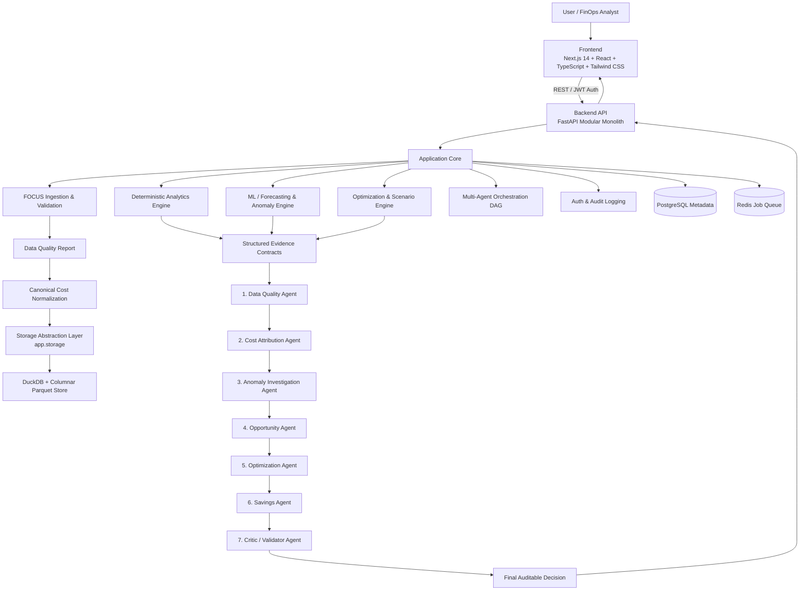
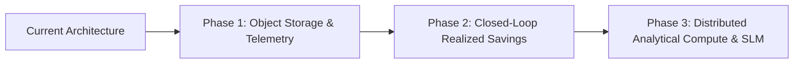

# finops-copilot

> **Production-Grade FinOps Decision-Intelligence Platform** powered by FOCUS Billing Data, Deterministic Analytics, Machine Learning, and Multi-Agent Evidence Reasoning.

[](https://fastapi.tiangolo.com)
[](https://nextjs.org)
[](https://duckdb.org)
[](https://focus.finops.org)
[](https://python.org)
[](LICENSE)

---

## 1. Executive Summary & Problem Statement

Cloud spending is among the fastest-growing operational expenses in modern engineering organizations, yet traditional cloud cost tools suffer from three fundamental flaws:
1. **Opaque Aggregations**: Dashboards present high-level charts without providing actionable, statistically rigorous root-cause explanations.
2. **Proprietary Vendor Lock-In**: Billing data is fragmented across proprietary AWS Cost Explorer, Azure Cost Management, and GCP Billing formats.
3. **Hallucinatory AI Chatbots**: Generative AI tools frequently invent numerical figures, produce ungrounded recommendations, or propose destructive modifications without evidence.

**finops-copilot** addresses these challenges by implementing an open, deterministic FinOps decision-support platform built on the **FinOps Open Cost and Usage Specification (FOCUS)**.

### Core Operational Cycle
```text
OBSERVE → EXPLAIN → DETECT → DIAGNOSE → OPTIMIZE → ESTIMATE → VALIDATE → DECIDE
```

---

## 2. Key Architecture Principles

- **Deterministic Ground Truth**: All financial calculations, period-over-period attribution, statistical z-scores, and time-series forecasts are strictly computed using DuckDB SQL and deterministic Python algorithms. **The LLM never calculates numbers.**
- **7-Stage Dependent Multi-Agent DAG**: An auditable agent chain where each stage receives structured Pydantic evidence contracts from upstream nodes, culminating in an independent Critic validation gate.
- **Explainability Over Generation**: Google Gemini (`gemini-3.5-flash-lite` / `gemini-3.6-flash`) is utilized strictly for natural-language synthesis, root-cause narrative generation, and contextual risk explanations over pre-validated JSON evidence.
- **LLM Failure Resilience**: The platform operates with zero downtime if external AI APIs are unreachable (`MockLLMProvider` mode ensures 100% offline functionality).
- **Zero Synthetic Billing Data in Analytics**: Ingests and validates authentic, publicly available FOCUS 1.0/1.0.1 billing data exports.
- **Human-in-the-Loop Safety**: As a pure decision-support platform, finops-copilot recommends and simulates actions—it never performs destructive resource shutdowns or deletions.
- **Centralized Storage Abstraction**: High-performance Parquet datasets and DuckDB storage resolve under a configurable `DATA_DIR`, storing environment-agnostic relative keys in PostgreSQL.

---

## 3. High-Level System Architecture



---

## 4. Multi-Agent Pipeline & Decision DAG

Rather than using independent chatbots producing disconnected prose, finops-copilot orchestrates a **dependent sequential DAG** governed by strict Pydantic schemas:

```text
[Data Quality Agent]          --> Validates schema integrity, null rates, and currency consistency
        ↓
[Cost Attribution Agent]      --> Computes top cost drivers and concentration scores (HHI)
        ↓
[Anomaly Investigation Agent] --> Investigates statistical spikes flagged by EWMA / Robust Z-Scores
        ↓
[Opportunity Agent]           --> Formulates optimization candidates from deterministic rule triggers
        ↓
[Optimization Agent]          --> Ranks actionable recommendations with risk levels and assumptions
        ↓
[Savings Agent]               --> Simulates projected impacts (strictly labelled ESTIMATED SAVINGS)
        ↓
[Critic / Validator Agent]    --> Enforces evidence checks, validates assumptions, prevents destructive actions
        ↓
[Final Decision]              --> Produces auditable, human-approvable recommendations with confidence scores
```

---

## 5. Prototype Storage Architecture & Missing Data Handling

finops-copilot separates transactional application metadata from high-performance analytical storage:

- **PostgreSQL**: Stores user records, dataset metadata, validation summaries, anomalies, recommendations, and relative object keys (`parquet/<dataset-id>/data.parquet`).
- **Local Analytics Storage (`DATA_DIR`)**: Parquet billing datasets and DuckDB analytical files resolve under `DATA_DIR` (default: `./data/`).

```text
DATA_DIR/
├── parquet/
│   └── <dataset-id>/
│       └── data.parquet       # Canonical columnar Parquet file
├── uploads/
│   └── <dataset-id>.csv       # Uploaded raw FOCUS billing files
└── finops-copilot.duckdb          # Embedded DuckDB database
```

### Prototype Storage Notice
- On free-tier hosting environments (e.g. Render Free), the filesystem is **ephemeral** and local Parquet files may reset upon server redeployment.
- If a dataset's metadata exists in PostgreSQL but its Parquet file is missing, the backend returns a clean `DATASET_STORAGE_MISSING` HTTP 404 response.
- Users can click **Delete** in **Settings & Datasets** to cleanly remove the stale record and re-ingest the CSV.

---

## 6. Honest System Limitations & Boundaries

To maintain technical rigor and integrity, finops-copilot explicitly documents its operational boundaries:

| Limitation | Operational Reality | Architectural Reason |
|---|---|---|
| **Billing-Only Telemetry** | Operates on FOCUS billing records; does not possess direct hypervisor OS telemetry (CPU%, RAM%, IOPS). | Flags candidates based on measurable rate/quantity divergences (*"Cost rose 40% while billed hours remained flat"*) rather than guessing unmeasured CPU starvation. |
| **Estimated vs. Realized Savings** | All savings figures are **ESTIMATED SAVINGS** calculated under explicit scenario assumptions. | Realized savings require post-implementation billing reconciliation across subsequent invoicing periods. |
| **Decision-Support Constraint** | Does not execute automated resource deletions, instance terminations, or network changes. | Protects production infrastructure through mandatory human-in-the-loop approval gates. |
| **Single-Node Analytical Engine** | Uses embedded, in-process DuckDB with file locks. | Optimized for sub-second aggregations on single instances; horizontal multi-node scaling requires detached analytical compute. |
| **LLM Role Limitation** | Gemini is restricted to contextual explanation and evidence validation. | Eliminates hallucinations by ensuring 100% of numerical calculations originate from SQL/code. |

---

## 7. Future Upgradations & Production Roadmap

To scale finops-copilot to enterprise multi-tenant deployments, the following architectural upgrades are mapped:



1. **Decoupled Cloud Object Storage (Cloudflare R2 / AWS S3)**:
   - Migrate analytical Parquet files to S3/R2 object storage and query them directly using DuckDB's `httpfs` extension, achieving zero local disk dependency on serverless and ephemeral web hosts.
2. **Telemetry Fusion (Prometheus, CloudWatch, Datadog APIs)**:
   - Integrate live metric collectors to fuse CloudWatch / Datadog $P_{95}$/$P_{99}$ CPU and memory metrics with FOCUS billing lines for true utilization-backed rightsizing.
3. **Closed-Loop Realized Savings Reconciliation**:
   - Automatically track approved recommendations against subsequent monthly billing files to verify actual cost reductions and compute verified **Realized Savings**.
4. **Distributed Columnar Compute (ClickHouse / MotherDuck)**:
   - Connect the analytics layer to MotherDuck or a ClickHouse cluster to support multi-billion row analytical queries across global multi-cloud enterprises.
5. **Specialized FinOps Small Language Model (SLM)**:
   - Fine-tune a 7B/8B parameter model with LoRA adapters on FOCUS 1.0 domain specifications and cloud pricing matrices for low-latency, deterministic, offline-capable FinOps reasoning.

---

## 8. Measured Benchmark & Verification Results

Evaluated against authentic FinOps Foundation FOCUS 1.0 Real Datasets:

| Component | Benchmark Metric | Measured Result | Status |
|---|---|---|---|
| **Ingestion Pipeline** | Ingestion & Validation Rate | 0.30s (1,000 billing rows) | **PASS** |
| **Forecasting Engine** | Method & Accuracy | Holt-Winters (`exp_smoothing`), MAE: $1.15, RMSE: $1.28 | **PASS** |
| **Anomaly Detection** | Spike Detection | 61 Statistical Anomalies flagged (Robust Z-Score + EWMA) | **PASS** |
| **Agent Pipeline** | 7-Stage DAG Execution | 7/7 Agents executed successfully (Duration: ~9.2s) | **PASS** |
| **Critic Safety Gate** | Final Recommendation | `APPROVE` with 100% confidence, safety checks passed | **PASS** |
| **LLM Fallback Mode** | `MockLLMProvider` | 100% operational with zero external API dependencies | **PASS** |
| **Backend Test Suite** | Pytest Coverage | **29 / 29 Tests Passed** (3.57s execution time) | **PASS** |
| **Frontend Production Build** | Next.js 14 Compilation | **15 / 15 Routes Compiled** (0 TypeScript/build errors) | **PASS** |

---

## 9. Technology Stack

| Layer | Technologies |
|---|---|
| **Frontend** | Next.js 14 (App Router), React 18, TypeScript, Tailwind CSS, Recharts, Lucide Icons |
| **Backend API** | Python 3.11+, FastAPI, Pydantic v2, structlog, python-jose, bcrypt |
| **Analytical Query Engine** | DuckDB (Embedded Columnar SQL), PyArrow, Pandas |
| **Machine Learning & Stats** | NumPy, SciPy, scikit-learn, LightGBM, Statsmodels |
| **Database & Cache** | PostgreSQL (Async SQLAlchemy 2.0 / asyncpg), Redis (ARQ async jobs) |
| **LLM Orchestration** | Google Gemini API (`GEMINI_MODEL=gemini-3.5-flash-lite`) + `MockLLMProvider` fallback |
| **Deployment** | Vercel (Frontend) + Render (Backend) / Docker Compose |

---

## 10. Quickstart & Local Setup

### Prerequisites
- Python 3.11+
- Node.js 18+ & npm
- Git

### Option A: Local Non-Docker Startup (Recommended)
```bash
# 1. Clone the repository
git clone https://github.com/kg3478/finops-copilot_Intelligence.git
cd finops-copilot_Intelligence

# 2. Run the automated local setup script
chmod +x start-local.sh
./start-local.sh
```

### Option B: Manual Startup

#### Backend
```bash
cd backend
python -m venv .venv
source .venv/bin/activate
pip install -r requirements.txt

# Run migrations and start server
export DATA_DIR=./data
uvicorn app.main:app --reload --port 8000
```

#### Frontend
```bash
cd frontend
npm install
npm run dev
```
Open [http://localhost:3000](http://localhost:3000) in your browser. Default admin credentials:
- **Email**: `admin@finops-copilot.local`
- **Password**: `changeme`

---

## 11. Testing & Validation Commands

```bash
# Run all backend unit, integration, and API tests
cd backend
.venv/bin/pytest tests/ -v

# Run frontend build check
cd frontend
npm run build
```

---

## 12. License

This project is licensed under the MIT License — see the [LICENSE](LICENSE) file for details.
