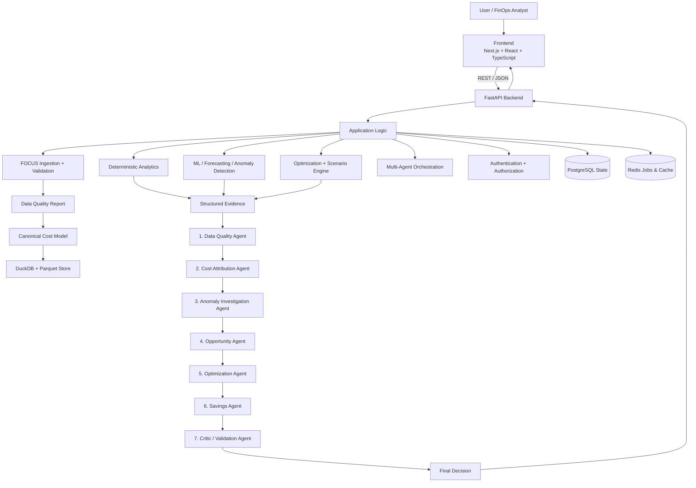

# finops-copilot — Architecture Documentation

## 1. Executive Architecture Summary

finops-copilot is a production-quality FinOps decision-intelligence platform built on a **modular monolith** architecture. It ingests FinOps Open Cost and Usage Specification (FOCUS) billing datasets, performs deterministic SQL/statistical analytics via DuckDB and scikit-learn/LightGBM, and streams evidence through a 7-agent dependent pipeline to produce auditable optimization recommendations.

---

## 2. High-Level Architecture Diagram

---

## 3. Core Architectural Decisions

### Why Deterministic Analytics Precede Agents?
LLMs are reasoning and explanation components, **not numerical computation engines**. All financial totals, percentage changes, statistical z-scores, and forecast point predictions are computed by deterministic Python code or DuckDB SQL queries. The LLM receives structured JSON evidence and is instructed to generate natural-language explanations without mutating or inventing numbers.

### Dual-Database Architecture
- **DuckDB + Parquet**: Used for high-speed analytical queries on millions of FOCUS billing rows. Columnar Parquet files allow sub-second aggregations without loading giant datasets into memory.
- **PostgreSQL**: Used for transactional application state (users, dataset metadata, anomaly records, recommendations, audit logs, agent run logs).

### LLM Failure Tolerance
If Google Gemini is unconfigured or unavailable, the application switches automatically to `MockLLMProvider`. All spend exploration, statistical anomaly detection, time-series forecasting, scenario simulations, and dashboard metrics remain **100% operational**.

---

## 4. Multi-Agent Pipeline Flow

The agent pipeline is a **dependent sequential DAG**:

1. **Data Quality Agent**: Validates dataset usability; halts pipeline if data quality status is `FAIL`.
2. **Cost Attribution Agent**: Identifies top cost drivers and concentration scores (HHI).
3. **Anomaly Investigation Agent**: Analyzes statistical spikes detected by EWMA and robust Z-score methods.
4. **Opportunity Agent**: Formulates optimization candidates based on rule triggers.
5. **Optimization Agent**: Ranks actionable recommendations with risk levels and assumptions.
6. **Savings Agent**: Simulates projected savings (labelled strictly as ESTIMATED SAVINGS).
7. **Critic / Validation Agent**: Audit gate that checks for evidence consistency, missing assumptions, destructive actions, and outputs the `FinalDecision`.
