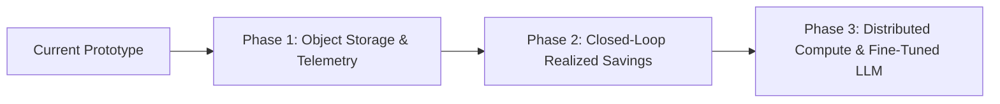

# CloudSpend Intelligence — Honest System Boundaries, Limitations & Future Roadmap

## 1. Current System Limitations & Boundaries

### 1.1 FOCUS Billing Data Scope (No Hypervisor Telemetry)
- **Boundary**: CloudSpend ingests and analyzes FOCUS billing and cost data. It does not possess direct real-time agent/OS telemetry (e.g. CPU%, RAM%, disk IOPS).
- **Technical Honesty Rule**: The system flags candidates for investigation based on measurable cost and quantity divergences (e.g., *"Cost increased 45% while billed quantity remained constant"*), rather than making unsupported utilization assumptions (e.g., *"This instance is underutilized"*).

### 1.2 Estimated vs. Realized Savings
- **Boundary**: All savings calculations are strictly categorized as **ESTIMATED SAVINGS** generated under specific scenario assumptions (e.g. 15% usage reduction or 1-year commitment discount).
- **Technical Honesty Rule**: The system never claims realized savings until post-implementation billing reconciliation has verified the actual cost delta.

### 1.3 Ephemeral Filesystem in Prototype Hosting Tier
- **Boundary**: On free-tier platforms like Render Free, the local filesystem is ephemeral and may reset upon container redeployments or cold restarts.
- **Handling**: The system detects missing storage cleanly, raises a structured `DATASET_STORAGE_MISSING` response (HTTP 404), and provides an idempotent dataset deletion workflow allowing clean re-ingestion.

### 1.4 In-Process Analytical Concurrency
- **Boundary**: The analytics engine utilizes in-process DuckDB with file locks. While exceptionally fast for single-node workloads (processing 100k+ rows in milliseconds), horizontal scaling across multiple web instances requires detached analytical compute.

### 1.5 Human-in-the-Loop Constraint
- **Boundary**: CloudSpend is an auditable **decision-support system**. It deliberately does not execute automated, destructive cloud resource deletions or modifications.

---

## 2. Future Upgradations & Production Roadmap

To transition CloudSpend Intelligence from a high-performance prototype into a multi-tenant enterprise FinOps engine, the following upgrades are planned:

### 2.1 Decoupled Object Storage (Cloudflare R2 / AWS S3)
- **Goal**: Persistent, zero-local-disk analytical storage.
- **Implementation**: Ingest Parquet datasets directly to Cloudflare R2 / AWS S3 and query them via DuckDB's `httpfs` extension with S3-compatible endpoints, eliminating local disk dependencies entirely.

### 2.2 Telemetry Fusion (Prometheus, CloudWatch, Datadog APIs)
- **Goal**: True utilization-backed rightsizing recommendations.
- **Implementation**: Build pluggable metric collectors that query CloudWatch / Datadog APIs to fuse real-time CPU/RAM percentiles ($P_{95}$, $P_{99}$) with FOCUS billing rows for deterministic idle-resource classification.

### 2.3 Automated Post-Implementation Reconciliation (Realized Savings Tracker)
- **Goal**: Measure actual financial impact.
- **Implementation**: When a recommendation is marked `APPROVED`, schedule an automated verification job that monitors subsequent billing periods, computes the variance against baseline, and records verified **Realized Savings**.

### 2.4 Distributed Analytical Engine (ClickHouse / MotherDuck)
- **Goal**: Multi-billion row enterprise scalability.
- **Implementation**: Migrate DuckDB to MotherDuck (cloud DuckDB) or a ClickHouse cluster for sub-second aggregations across multi-account, multi-cloud enterprise billing exports.

### 2.5 Domain-Specific FinOps SLM (Small Language Model) & Fine-Tuning
- **Goal**: Low-latency, deterministic, offline-capable FinOps reasoning.
- **Implementation**: Fine-tune a specialized 7B/8B parameter model (e.g. Llama 3 / Mistral) on FOCUS 1.0 specifications and cloud pricing structures using LoRA adapters for precise, hallucination-free explanations.
